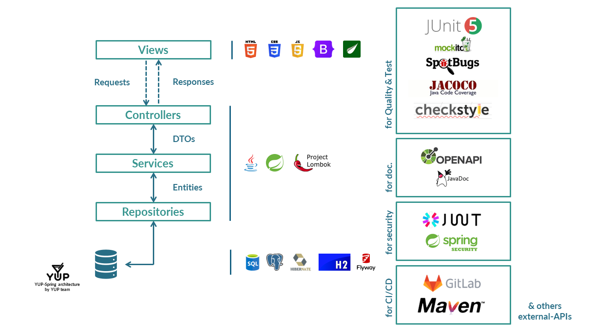

<h1>YUP</h1>
<h2>Your Unique Party</h2>

  

  
  
  
  
  
  
  
  

<h3>Use YUP</h3>
    
YUP is available at <a href="https://www.youruniqueparty.com">www.youruniqueparty.com</a>

<h3>Introduction</h3>

YUP is born with the idea of promoting recreational parties and events, aiming to provide an accessible overview of entertainment in a given area for both young and older individuals. Whether it's "happy hours" or private parties, YUP presents them in a user-friendly web application. For YUP, every user matters, which is why personalized loyalty approaches are implemented. Even organizers utilize YUP. The web app allows for managing customers, loyalty aspects, and bookings.

If it's a party, it's a YUP.

<h3>YUP team</h3>

Our team: 

<ul>
  <li>Mattia Piazzalunga - <em>851931</em>; </li>
  <li>Matteo Severgnini - <em>851920</em>; </li>
  <li>Nicolò Urbani - <em>856213</em>. </li>
</ul>

For any problems or questions contact us at <a href="mailto:team@youruniqueparty.com">team@youruniqueparty.com</a>

<h3>License</h3>

YUP is released under the <strong>MIT license</strong>. 

  

<h3>The architecture</h3>

The basic architecture of YUP is the monolithic tier architecture suggested and used by Spring Boot.

  

It consists, in its most general form, of five components:

<ul>
	<li>
    <strong>Views.</strong> These frontend-side pages, external to the main backend architecture, interpret and manage user actions and convert requests to the backend. Furthermore, they modify their behavior and interface based on the responses generated by the server.
  </li>
  <li>
    <strong>Controllers.</strong> These handle incoming HTTP requests and coordinate the control flow of the application. Controllers interact with services to process requests and return appropriate responses.
  </li>
  <li>
    <strong>DTOs (Data Transfer Objects).</strong> These objects are used to transfer data between the various layers of the application, such as controllers and services. They are often used to encapsulate data from incoming HTTP requests or to represent data to be returned as a response. The use of DTOs helps to separate presentation logic from business logic and improve the modularity of the application.
  </li>
  <li>
    <strong>Services.</strong> These contain the business logic of the application. Services are responsible for processing data, enforcing business rules, and coordinating operations among multiple entities. Services can access repositories to retrieve or store persistent data.
  </li>
  <li>
    <strong>Entities.</strong> They represent the domain concepts of the application and are often mapped directly to relational database tables.
  </li>
  <li>
    <strong>Repositories.</strong> These provide an abstraction for data access. In Spring, repositories are often implemented using Spring Data JPA, which simplifies interaction with the database by providing methods for performing basic operations on persistent entities.
  </li>
</ul>

<h3>Main languages, technologies and frameworks:</h3>

<ul>
  <li><strong>Frontend.</strong> HTML5, CSS3, Javascript ES6 & Bootstrap 5.1, Thymeleaf 3.1.2;</li>
  <li><strong>Backend.</strong> Java 21, Spring Boot 3.2.3.</li>
  <li><strong>Database.</strong> SQL:2023 - ISO/IEC 9075:2023, PostgreSQL 16.0.0, H2 1.4.200 for local/test profiles & FlyWay 8.5.12.</li>
</ul>

<h4>Front-end Technology Selection</h4>
Considering the main purpose of the project, which prioritizes adherence to Scrum
principles and Agile methodologies, and acknowledging the expertise of the team, technologies
that are a de-facto standard have been chosen.
Thymeleaf offers a faster, simpler, and more integrated
development path, especially since the team is familiar with Java/Spring technologies.
By leveraging the technologies descripted, the team can build a modern and efficient web
application that meets the project requirements effectively.

<h3>Documentation</h3>
The generated documentation is available on GitLab Pages at the following links:
<ul>
  <li><a href="https://yup-mattiapiazzalunga-c7564dca12835701c03806523fdc793b495dd7758.gitlab.io/apidocs"> Java Documentation - API Documentation</a></li>
  <li><a href="https://yup-mattiapiazzalunga-c7564dca12835701c03806523fdc793b495dd7758.gitlab.io/restdocs"> OpenAPI - RestAPI Documentation</a></li>
</ul>